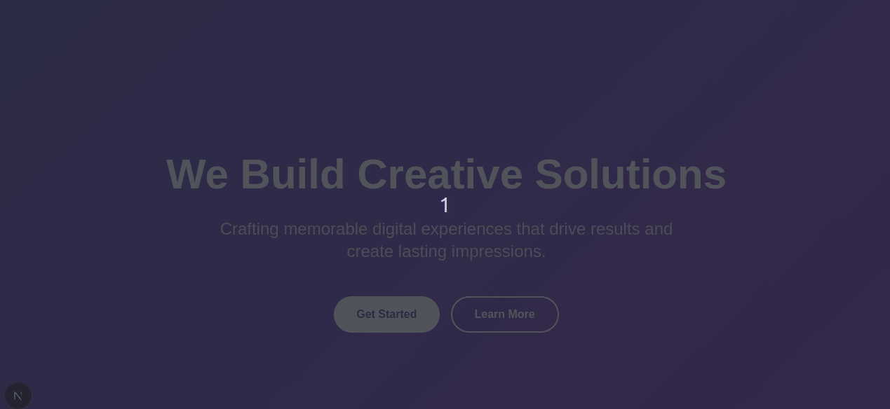

# ✨ Next.js Animated Landing Page with Dynamic Effects

[](https://nextjs.org/)
[](https://tailwindcss.com/)
[](https://www.framer.com/motion/)



## 🚀 Features

- **Dynamic Mouse Tracking Effects**
- **Smooth Text Animations**
- **Interactive Particle System**
- **Responsive Design**
- **WebGL-ready Architecture**
- **SSR-Compatible Animations**

## 🛠 Technologies

| Technology | Purpose |
|------------|---------|
| [Next.js](https://nextjs.org/) | React Framework |
| [Tailwind CSS](https://tailwindcss.com/) | Utility-first CSS |
| [Framer Motion](https://www.framer.com/motion/) | Animation Library |
| [TypeScript](https://www.typescriptlang.org/) | Type Safety |
| [Three.js](https://threejs.org/) (Optional) | 3D Effects |

## 📦 Installation

1. Clone the repository:
```bash
git clone https://github.com/atozICT20/text-transition-landing
cd text-transition-landing
```

2. Install dependencies:
```bash
npm install
# or
yarn install
```

3.Start development server:
```bash
npm run dev
# or
yarn dev
```
Open [http://localhost:3000](http://localhost:3000) to view it in your browser.


## 🏗 Project Structure

```bash
src/
├── app/
│   ├── layout.tsx         # Root layout
│   └── page.tsx           # Home page
├── components/
│   ├── AnimatedHero.tsx   # Main animation component
│   └── TextTransition.tsx # Text effects
├── styles/
│   └── globals.css        # Global styles
public/
├── preview.gif            # Demo gif
└── favicon.ico            # Site icon
```

## 🎨 Customization

### Change Content
Modify `src/app/page.tsx`:
```tsx
const heroContent = {
  title: "We Build",
  words: ["Innovation", "Experiences", "Solutions"],
  subtitle: "Creating digital magic for your brand"
};
```
Update Colors
Edit the gradient in AnimatedHero.tsx:

```tsx
<motion.div 
  className="absolute inset-0 bg-gradient-to-br from-blue-900 to-purple-600"
  {/* ... */}
/>
```
Adjust Animations
Configure tailwind.config.ts:

```bash
extend: {
  animation: {
    'fade-in': 'fadeIn 0.6s ease-out forwards',
    'float': 'float 3s ease-in-out infinite'
  }
}
```

## 🌐 Deployment

### Vercel (Recommended)
[](https://vercel.com/new/clone?repository-url=https://github.com/your-username/nextjs-animated-landing)

1. Push to GitHub
2. Import to Vercel
3. Automatic deployments

### Alternative Platforms
- Netlify
- AWS Amplify
- Docker Container

## 🐛 Troubleshooting

| Issue | Solution |
|-------|----------|
| Hydration Errors | Ensure 'use client' directives |
| Missing Animations | Check Framer Motion version |
| Performance Issues | Reduce particle count |


## ✉️ Contact
For support, email: 

---

**Enjoy creating beautiful animations!** 🎉